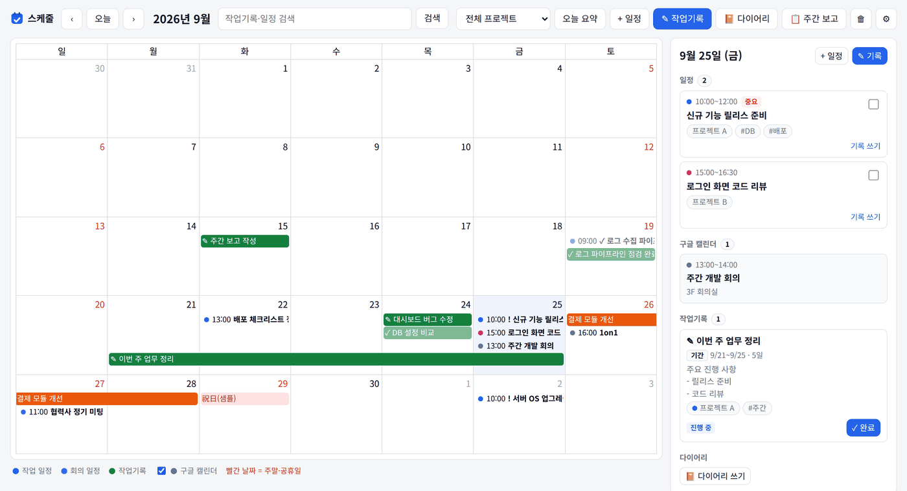
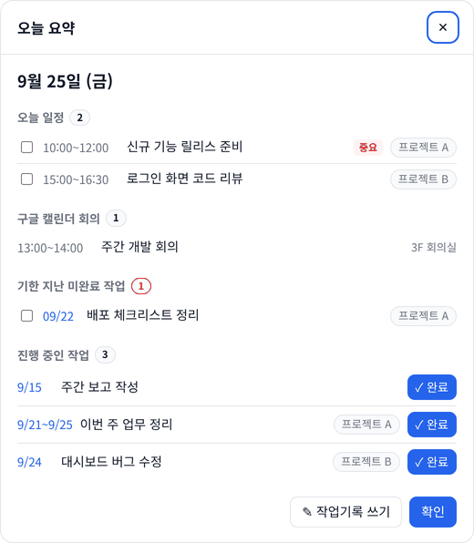
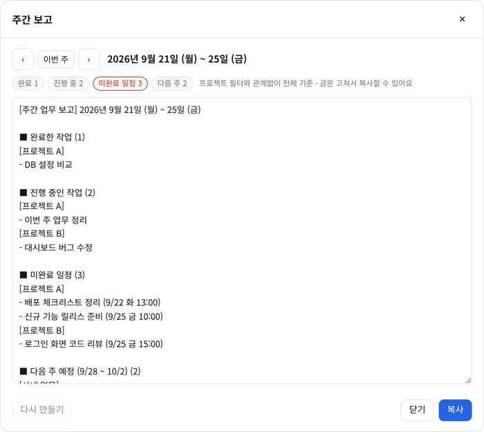
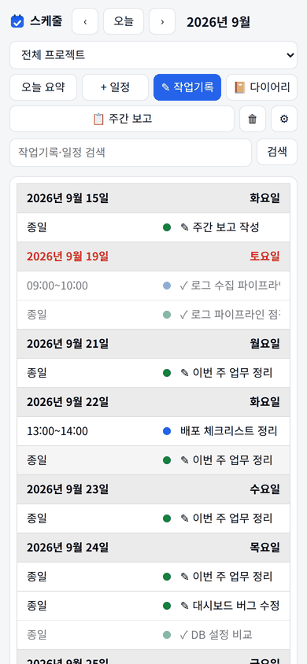
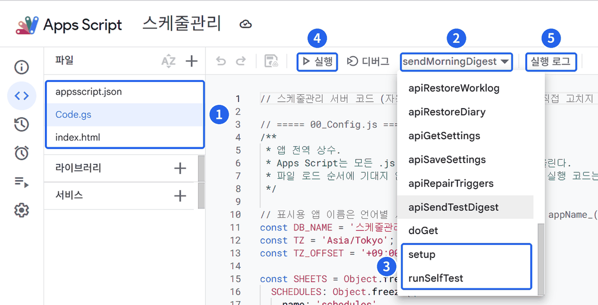

<p></p>

# 스케줄관리 (개인 일정·작업기록 앱)

일정·작업기록·다이어리를 한 화면에서 관리하는 **개인용** 앱입니다.
서버나 프로그램 설치 없이, **각자 자기 Google 계정에 설치해서 혼자 씁니다.**

<p align="center"></p>
<p align="center"><sub>메인 화면 — 왼쪽은 월 캘린더(일정·작업기록·구글 캘린더 회의·공휴일), 오른쪽은 고른 날짜의 일정·작업기록·다이어리. 화면의 데이터는 예시입니다.</sub></p>

| 오늘 요약 (그날 처음 열 때) | 주간 보고 (글 만들어 복사) | 휴대폰 화면 |
|:---:|:---:|:---:|
|  |  |  |

> **처음 설치하는 분은 이 순서대로 따라 하세요 (약 20분)**
>
> [0. 준비물](#0-준비물) → [1. 파일 받기](#1-파일-받기) → [2. 설치하기](#2-설치하기-설치-방법-a) → [3. 처음 써 보기](#3-처음-써-보기)
>
> 막히면 [문제가 생기면](#문제가-생기면)을 보세요. 낯선 말은 맨 아래 [용어 풀이](#용어-풀이)에 있습니다.

---

## 이런 앱입니다

| 항목 | 내용 |
|---|---|
| 설치 위치 | 설치하는 사람의 Google 계정 (Apps Script 프로젝트 1개 + 스프레드시트 1개) |
| 데이터 | 본인 Google 드라이브의 `스케줄관리 DB` 스프레드시트. 다른 사람과 공유되지 않습니다 |
| 접속 | 본인 계정으로 로그인해야만 열립니다 (웹앱 액세스 "나만" + 서버에서 소유자를 한 번 더 확인) |
| 알림 메일 | 본인 Gmail에서 본인에게 보냅니다 |
| 코드를 준 사람 | 설치된 앱·데이터·메일 어디에도 관여하지 않고, 볼 수도 없습니다 |

### 주요 기능

| 기능 | 내용 |
|---|---|
| 월 캘린더 | 작업·회의 일정, 작업기록, 구글 캘린더 회의(읽기만), 일본 공휴일을 한 화면에 표시. 토·일·공휴일은 빨간 날짜 |
| 일정 관리 | 작업/회의, 종일·시각, 우선순위, 프로젝트, 태그, 장소·회의 링크, 상태(예정/완료/취소) |
| 작업기록 | **하루 기록**(날짜별 여러 건)과 **기간 기록**(시작일~종료일, 최대 92일). 프로젝트, 태그, 연결 일정, **상태(진행 중/완료)** |
| 다이어리 | 날짜별 한 편. 헤더의 `📔 다이어리`에서 주 단위로 보기, 검색 |
| 검색 | 작업기록·일정 키워드 검색(태그 포함), 프로젝트·기간 필터 |
| 주간 보고 | 헤더의 `📋 주간 보고`: 한 주의 완료·진행 중 작업, 미완료 일정, 다음 주 예정을 프로젝트별로 묶은 글을 만들어 복사 |
| 삭제 복구 | 지운 직후 알림의 `되돌리기`(10초), 나중에는 헤더의 `🗑` 휴지통에서 최근 30일 안에 지운 것 복구 |
| 아침 알림 | 앱을 그날 처음 열 때 "오늘 요약" 팝업 + 평일 아침 요약 메일(기본 07~08시, 주말·일본 공휴일 제외) |
| 백업 | 매주 월요일 새벽 스프레드시트를 드라이브 백업 폴더에 복사, 최근 8개 보관 |
| 언어 | **한국어·일본어**. `⚙ 설정` → `일반` → `언어`에서 바꾸면 모든 기기와 아침 메일에 적용 |

**지원 범위:** 일본 시간(UTC+9) 기준입니다. 한국도 UTC+9라 시각은 그대로 맞지만, 공휴일은 일본 공휴일을 씁니다.

---

## 0. 준비물

| 준비물 | 설명 |
|---|---|
| PC와 크롬 브라우저 | 설치는 PC에서 합니다. 설치가 끝나면 휴대폰에서도 씁니다 |
| 앱을 쓸 Google 계정 | 개인 Gmail이나 회사 계정. **데이터는 이 계정의 드라이브에 저장됩니다** |
| GitHub 계정 | 파일을 받을 때만 필요합니다 (초대 메일을 받은 계정) |
| 메모장 | 받은 파일의 내용을 복사할 때 씁니다 (Windows 기본 메모장이면 됩니다) |

> 💡 **크롬에 Google 계정이 여러 개 로그인돼 있으면** 설치나 실행이 엉뚱한 계정으로 될 수 있습니다.
> 앱을 쓸 계정 하나만 로그인한 **크롬 프로필**을 따로 만들어 쓰면 안전합니다 (크롬 오른쪽 위 프로필 아이콘 → 추가).

---

## 1. 파일 받기

이 앱은 GitHub 비공개 저장소 `biyanet-ap/schedule-app`으로 나눠 줍니다.

1. GitHub에서 온 **초대 메일**을 열고 **Join(초대 수락)** 을 누릅니다
2. GitHub에 로그인한 상태로 **https://github.com/biyanet-ap/schedule-app/releases** 를 엽니다
3. 맨 위(최신) 버전의 **Assets**에서 **`schedule-app.zip`** 을 눌러 받습니다 (「Source code」 말고 `schedule-app.zip`)
    - 같은 곳에 그림이 들어간 **설명서 PDF**도 있습니다: `schedule-app-manual-ko.pdf`(한국어), `schedule-app-manual-ja.pdf`(日本語)
4. 받은 zip 파일을 오른쪽 클릭 → **압축 풀기** 합니다

✅ **확인:** 압축을 푼 `schedule-app` 폴더 안의 **`apps-script`** 폴더에 파일 3개가 있으면 준비 끝입니다.

| 파일 | 내용 |
|---|---|
| `appsscript.json` | 권한·웹앱 설정 |
| `Code.gs` | 서버 프로그램 |
| `index.html` | 화면 (약 500KB) |

> Windows에서 확장자를 숨기게 설정돼 있으면 `appsscript`, `Code`, `index`처럼 이름만 보일 수 있습니다. 같은 파일입니다.

- 새 버전 알림을 받으려면 저장소 오른쪽 위 **Watch → Custom → Releases** 를 체크합니다
- 개발자는 `git clone https://github.com/biyanet-ap/schedule-app.git` 후 [설치 방법 B](#설치-방법-b-개발자용)를 보세요

---

## 2. 설치하기 (설치 방법 A)

브라우저만으로 설치합니다. **처음 한 번만** 하면 됩니다.

```
2-1 새 프로젝트  →  2-2 파일 3개 넣기  →  2-3 setup 실행  →  2-4 runSelfTest 점검  →  2-5 웹앱 배포
```

> 화면 문구는 Google 화면 언어 설정에 따라 조금 다를 수 있습니다.

### 2-1. 새 프로젝트 만들기

1. 앱을 쓸 계정으로 로그인한 크롬 주소창에 **`script.new`** 를 입력하고 Enter → Apps Script **편집기**가 열립니다
2. 왼쪽 위 **제목 없는 프로젝트**를 누르고 이름을 **`스케줄관리`** 로 바꿉니다
3. 왼쪽 **⚙ 프로젝트 설정** → **"편집기에서 'appsscript.json' 매니페스트 파일 표시"** 를 체크합니다
4. 왼쪽 **`< >` (편집기)** 를 눌러 돌아옵니다

✅ **확인:** 왼쪽 「파일」 목록에 `appsscript.json`, `Code.gs` 두 개가 보입니다.

### 2-2. 파일 3개 넣기

세 파일 모두 **같은 방법**으로 넣습니다.

1. 받은 파일을 오른쪽 클릭 → **연결 프로그램 → 메모장**으로 엽니다
2. 메모장에서 **Ctrl+A**(전체 선택) → **Ctrl+C**(복사)
3. 편집기 왼쪽 목록에서 넣을 파일을 누릅니다
4. 편집기 본문을 한 번 클릭하고 **Ctrl+A** → **Ctrl+V** (원래 있던 내용은 **전부 지워지고** 새 내용으로 바뀝니다)

| 순서 | 편집기의 파일 | 넣을 내용 |
|---|---|---|
| ① | `appsscript.json` | `apps-script/appsscript.json` |
| ② | `Code.gs` | `apps-script/Code.gs` |
| ③ | `index.html` (**새로 만듭니다**) | `apps-script/index.html` |

**③ index 파일 만들기:** 「파일」 옆 **＋** → **HTML** → 이름 칸에 **`index`** 만 입력하고 Enter → 위 1~4대로 내용을 넣습니다 (약 500KB라 붙여 넣기에 몇 초 걸립니다).

> ⚠️ **이름 칸에 `index.html`까지 쓰지 마세요.** `.html`은 자동으로 붙습니다.
> 목록에 **`index.html.html`** 로 보이면 웹앱이 화면 파일을 찾지 못해 열리지 않습니다.
> 이때는 파일 이름에 마우스를 올려 **⋮ → 이름 바꾸기** → `index`만 입력합니다.

마지막으로 **Ctrl+S**로 저장합니다.

✅ **확인:** 왼쪽 목록에 `appsscript.json`, `Code.gs`, `index.html` 3개가 보입니다.

### 2-3. setup 실행 (권한 승인)

편집기에서 함수를 실행하는 방법입니다. 뒤에 나오는 `runSelfTest`, `setupFavicon`도 같은 방법으로 실행합니다.



| 번호 | 할 일 |
|---|---|
| ① | 파일 3개(`appsscript.json`, `Code.gs`, `index.html`)를 확인합니다. `index.html.html`로 보이면 [2-2](#2-2-파일-3개-넣기)의 ⚠️대로 이름을 고칩니다 |
| ② | 위쪽 함수 이름(▾)을 눌러 목록을 엽니다 |
| ③ | 목록 **맨 아래**에서 **`setup`** 을 고릅니다 (목록이 길면 아래로 내립니다) |
| ④ | **▷ 실행**을 누릅니다 |
| ⑤ | 아래쪽 **실행 로그**에 결과가 나옵니다 |

**처음 실행하면 권한 승인 창이 뜹니다.** 아래대로 진행하세요.

1. **권한 검토** → 앱을 쓸 계정을 고릅니다
2. **"Google에서 확인하지 않은 앱"** 화면이 나오면 → **고급** → **스케줄관리(으)로 이동**
    - 방금 본인이 만든 스크립트라서 나오는 안내입니다. 개발자 이메일도 본인 계정으로 나옵니다
3. 권한 목록에 체크 상자가 있으면 **모두 선택**한 뒤 **계속(허용)** 을 누릅니다
    - 일부만 허용하면 메일·캘린더 등 일부 기능이 동작하지 않습니다

| 요청하는 권한 | 쓰는 곳 |
|---|---|
| 스프레드시트 | 일정·작업기록 저장 (`스케줄관리 DB`) |
| 드라이브 | 주간 백업, 탭 아이콘 파일 |
| 캘린더 보기 | 회의·일본 공휴일 표시 (읽기만, 캘린더를 고치지 않음) |
| 메일 보내기 | 본인에게 보내는 아침 요약 메일 |
| 예약 실행(트리거) | 아침 메일·주간 백업 자동 실행 |
| 이메일 주소 | 본인(설치한 사람)인지 확인 |

✅ **확인:** 실행 로그에 `[OK] 스프레드시트 생성`, `[OK] 트리거 설치` 같은 줄이 나오면 성공입니다.

- `setup`은 여러 번 실행해도 안전합니다 (이미 있는 시트·데이터는 그대로 둡니다)
- Google 계정 언어가 한국어가 아니면 로그는 일본어로 나옵니다 (예: `[OK] スプレッドシート作成`)

### 2-4. runSelfTest로 점검

[2-3](#2-3-setup-실행-권한-승인)과 같은 방법으로 함수 목록에서 **`runSelfTest`** → **▷ 실행**.

| 결과 | 뜻 |
|---|---|
| 모든 줄이 `[OK]` | 정상입니다. 2-5로 넘어갑니다 |
| 공휴일 줄만 `[WARN]` | 일본 공휴일 캘린더가 없는 것입니다. 앱은 쓸 수 있고, 아래 방법으로 추가하면 공휴일이 표시됩니다 |
| `[FAIL]` 줄이 있음 | [문제가 생기면](#문제가-생기면)을 보거나, 그 줄을 복사해 설치해 준 사람에게 보내 주세요 |

**일본 공휴일 캘린더 추가하기**
1. 구글 캘린더(calendar.google.com) 왼쪽 **다른 캘린더** 옆 **＋** → **관심 있는 캘린더 찾아보기** → **지역 공휴일**
2. **일본 공휴일**을 체크합니다. 구글 화면 언어에 따라 이름이 다르며, 어느 것을 추가해도 됩니다

    | 구글 화면 언어 | 찾을 이름 |
    |---|---|
    | 한국어 | 일본 공휴일 |
    | 일본어 | 日本の祝日 |
    | 영어 | Holidays in Japan |

3. 편집기로 돌아와 **`setup`** 을 한 번 더 실행합니다

- 한국어 화면에서 추가한 캘린더는 목록에 **일본의 휴일**로 보일 수 있고, 공휴일 이름이 영어로 나옵니다 (예: National Foundation Day)
- 日本の祝日 캘린더도 함께 추가돼 있으면 그쪽(일본어 이름)을 먼저 씁니다

### 2-5. 웹앱으로 배포

1. 편집기 오른쪽 위 파란 **배포** → **새 배포**
2. **유형 선택** 옆 ⚙ → **웹 앱**
3. 아래처럼 입력합니다

    | 항목 | 값 |
    |---|---|
    | 설명 | `v1` |
    | 다음 사용자 인증 정보로 실행 | **나** |
    | 액세스 권한이 있는 사용자 | **나만** ← ⚠️ 꼭 확인 (다른 값이면 다른 사람도 열 수 있습니다) |

4. **배포**를 누르면 **웹 앱 URL**(`https://script.google.com/macros/s/.../exec`)이 나옵니다
5. 이 URL을 크롬에서 열고 **Ctrl+D**로 북마크에 등록합니다

✅ **확인:** 앱 화면이 열리면 설치 끝입니다 🎉

### 2-6. (선택) 브라우저 탭 아이콘

함수 목록에서 **`setupFavicon`** → **▷ 실행** → 웹앱을 새로 고치면 브라우저 탭에 로고가 보입니다.

- 내 드라이브에 `스케줄관리_favicon.png`(로고 그림 하나)를 만들고 **링크가 있는 사용자 — 뷰어**로 공유합니다. 웹앱·시트·백업은 그대로 비공개입니다
- 회사 계정에서 외부 공유가 막혀 있으면 로그에 `[WARN]`만 남고 앱은 그대로 동작합니다 (탭은 구글 기본 아이콘)
- 다른 곳에 올린 이미지를 쓰려면 ⚙ 프로젝트 설정 → **스크립트 속성**에 `FAVICON_URL`(https로 시작하고 `.png`나 `.ico`로 끝나는 주소)을 추가합니다. 이 값이 있으면 먼저 씁니다

---

## 3. 처음 써 보기

| 이럴 때 | 이렇게 |
|---|---|
| 위쪽에 **"이 애플리케이션은 Google Apps Script 사용자가 만들었습니다"** 줄이 보임 | 정상입니다. 직접 설치한 앱에 구글이 붙이는 안내라 그대로 쓰면 됩니다 (앱에서 없앨 수 없습니다) |
| "오늘 요약" 창이 뜸 | 그날 처음 열 때 오늘 일정·밀린 작업을 보여 줍니다. 끄려면 `⚙ 설정` → `일반` |
| 화면 언어를 바꾸고 싶음 | `⚙ 설정` → `일반` → `언어` (한국어·日本語) |
| 아침 메일이 잘 오는지 보고 싶음 | `⚙ 설정` → `테스트 메일 보내기` |
| 휴대폰에서 쓰고 싶음 | 같은 웹 앱 URL을 휴대폰 크롬에서 엽니다 (**같은 Google 계정**으로 로그인). 메뉴 → **홈 화면에 추가**하면 앱처럼 쓸 수 있습니다 |

---

## 업데이트 받았을 때

새 버전이 나오면 [1. 파일 받기](#1-파일-받기)대로 새 `schedule-app.zip`을 받은 뒤:

1. 새 `apps-script/Code.gs`, `apps-script/index.html`로 편집기의 같은 파일 내용을 **전부 교체** → **Ctrl+S**
2. 릴리스 설명에 **"setup 필요"** 가 있으면 `setup` 실행 (기존 데이터는 그대로입니다)
3. **배포 → 배포 관리 → ✏(편집) → 버전: 새 버전 → 배포**

> ⚠️ 업데이트할 때는 **"새 배포"가 아니라 "배포 관리"** 에서 고칩니다. 새 배포를 만들면 웹 앱 URL이 바뀝니다.

| 릴리스 설명의 안내 | 할 일 |
|---|---|
| (특별한 안내 없음) | 파일 교체 → 새 버전 배포 |
| setup 필요 | 파일 교체 → `setup` 실행 → 새 버전 배포 |
| 권한 재승인 필요 | `appsscript.json`까지 파일 3개 모두 교체 → 실행할 때 권한 다시 승인 → 새 버전 배포 |

---

## 문제가 생기면

| 증상 | 해결 |
|---|---|
| 웹앱이 열리지 않음 (오류 화면) | 편집기 목록에 `index.html.html`로 보이면 이름을 `index`로 바꾸고 → 저장 → **배포 관리**에서 새 버전 배포 |
| 함수 목록에 `setup`이 안 보임 | 목록을 **아래로** 내려 보세요. 그래도 없으면 `Code.gs`에 내용을 붙여 넣고 **Ctrl+S**로 저장했는지 확인 |
| "Google에서 확인하지 않은 앱" | 정상입니다. **고급 → 스케줄관리(으)로 이동** ([2-3](#2-3-setup-실행-권한-승인)) |
| 권한을 일부만 허용했음 | 편집기에서 `setup`을 다시 실행해 **모두 선택**. 승인 창이 뜨지 않으면 [Google 계정의 연결된 앱 목록](https://myaccount.google.com/connections)에서 `스케줄관리`의 액세스를 삭제한 뒤 다시 실행 |
| 화면에 "권한이 없습니다" | 설치한 계정과 다른 계정으로 연 것입니다. 크롬 프로필·로그인 계정을 확인하세요 |
| 화면에 "초기 설정이 필요합니다" | 편집기에서 `setup` 실행 |
| 화면에 "일본 공휴일 캘린더를 읽을 수 없어서…" | [2-4의 공휴일 캘린더 추가하기](#2-4-runselftest로-점검). 추가한 뒤 `runSelfTest` 공휴일 줄이 `[OK] … 구독됨: <캘린더 이름>`이면 정상 |
| 아침 메일이 안 옴 | `⚙ 설정` → 최근 기록 (주말·공휴일·꺼짐이면 정상). 스프레드시트 `notify_log` 시트에도 남습니다 |
| 탭 아이콘이 안 보임 | `runSelfTest`의 `파비콘` 줄. `[WARN]`이면 `setupFavicon` 다시 실행. 공유가 막힌 계정이면 `FAVICON_URL`로 다른 곳의 이미지를 지정 |
| 서버 오류 | 편집기 왼쪽 **실행 기록**(≡▶ 아이콘)에서 오류 문구 확인 |

> 설치해 준 사람은 내 데이터와 실행 기록을 볼 수 없습니다. 도움을 받을 때는 **오류 문구나 `runSelfTest` 결과를 복사해서** 보내 주세요.

---

## 설정 바꾸기

앱 헤더의 **⚙ 설정** → `일반` 탭에서 바꾸고 `저장`을 누릅니다. 같은 창에서 예약 작업 상태 확인·`다시 걸기`, `테스트 메일 보내기`, 최근 발송 기록을 볼 수 있습니다. 프로젝트 관리는 `프로젝트` 탭에 있습니다.

<details>
<summary>설정 값 목록 (스프레드시트 <code>settings</code> 시트)</summary>

값은 스프레드시트 `스케줄관리 DB`의 `settings` 시트에 저장됩니다. 시트에서 직접 고쳐도 되지만, **발송 시각(`digest_hour`)은 앱에서 바꿔야** 예약이 함께 바뀝니다 (시트만 고쳤다면 설정 창의 `다시 걸기`).

| key | 기본값 | 의미 |
|---|---|---|
| notify_enabled | TRUE | 아침 메일 발송 |
| digest_hour | 7 | 아침 메일 발송 시각 (5~10, 그 시각 ~ 1시간 사이) |
| notify_when_empty | TRUE | 오늘 일정이 없어도 메일 발송 |
| skip_holidays | TRUE | 일본 공휴일에는 메일 안 보냄 |
| today_popup | TRUE | 앱을 그날 처음 열 때 오늘 요약 자동 표시 (모든 기기 공통) |
| backup_keep | 8 | 보관할 백업 개수 (1~100) |
| language | auto | 화면·메일 언어: `auto`(브라우저 언어), `ko`, `ja`. 모든 기기 공통 |

</details>

---

## 앱을 그만 쓸 때 (데이터 삭제)

1. 편집기 왼쪽 **트리거**(⏰) 메뉴에서 트리거 2개를 삭제합니다
2. **배포 → 배포 관리**에서 웹앱 배포를 보관처리합니다
3. 드라이브에서 `스케줄관리 DB`, `스케줄관리_backup` 폴더, `스케줄관리_favicon.png`(만들었다면), `스케줄관리` 스크립트를 삭제합니다

---

## 설치 방법 B (개발자용)

소스를 고치거나 테스트를 돌릴 분용입니다. 그냥 쓰실 분은 [설치 방법 A](#2-설치하기-설치-방법-a)면 충분합니다.

<details>
<summary>Node.js + clasp로 설치·업데이트·롤백</summary>

**필요한 것:** Node.js 22.12 이상, 앱을 쓸 Google 계정

```powershell
# 0) 이 폴더에서
npm ci

# 1) Apps Script API 켜기 (브라우저)
#    https://script.google.com/home/usersettings → "Google Apps Script API" 사용

# 2) clasp 로그인 (앱을 쓸 계정으로)
npx clasp login

# 3) Apps Script 프로젝트 만들기 → .clasp.json 생성됨
npx clasp create-script --type standalone --title "스케줄관리" --rootDir gas

# 4) 테스트 + 빌드 + 업로드 (매니페스트 포함)
npm run push
```

5. `npx clasp open-script`로 편집기를 열고 **`setup`** → **`runSelfTest`** 실행 (방법 A의 2-3~2-4와 같음). 이 방법은 파일이 여러 개로 나뉘어 올라가므로, 함수 목록에는 **지금 열려 있는 파일**의 함수만 보입니다 (`setup`·`runSelfTest`는 `80_Setup.gs`, `setupFavicon`은 `52_FaviconService.gs`)
6. 웹앱 배포
   ```powershell
   npx clasp create-deployment --description "v1"
   npx clasp list-deployments   # @HEAD가 아닌 줄의 ID가 배포 ID
   ```
   편집기 `배포 → 배포 관리`에서 **실행: 나 / 액세스 권한: 나만** 인지 확인합니다.

**업데이트**
```powershell
npm run push
npx clasp create-version "변경 내용"
npx clasp update-deployment <배포ID> --versionNumber <방금 만든 버전>
```
> **시트 열이 추가된 버전**은 `npm run push` 뒤에 편집기에서 **`setup`을 한 번 실행**하세요.

**롤백**
```powershell
npx clasp list-versions
npx clasp update-deployment <배포ID> --versionNumber <이전 버전>
```

**로컬 개발**
```powershell
npm run dev        # 샘플 데이터로 화면 개발 (Google 연결 없음) → http://localhost:5173
npm test           # 서버(gas/*.js)·화면 유틸 테스트
npm run typecheck  # 타입 체크
```

</details>

<details>
<summary>폴더 구조</summary>

```
apps-script/             브라우저 설치용 파일 3개 (전달 패키지에만 있음)
config/appsscript.json   Apps Script 매니페스트 원본 (권한 범위, 웹앱 설정)
gas/                     서버 코드 (Apps Script)
src/                     화면 (Vue 3)
tests/                   테스트
scripts/                 빌드·전달 패키지 스크립트 (make-icons.mjs: 로고를 바꿀 때 아이콘 다시 만들기, sharp 필요)
assets/                  로고 원본(logo.svg)과 PNG, README 그림·화면 예시(readme/)
```

</details>

---

## 용어 풀이

| 용어 | 뜻 |
|---|---|
| Apps Script 편집기 | `script.google.com`에서 프로그램 파일을 넣고 실행하는 화면. 설치할 때만 씁니다 |
| 함수 | `setup`, `runSelfTest`처럼 편집기에서 골라 실행하는 작업 이름 |
| 실행 로그 | 함수를 실행한 결과가 나오는 창. `[OK]`는 정상, `[WARN]`은 주의, `[FAIL]`은 실패 |
| 배포 / 웹 앱 URL | 앱을 브라우저로 열 수 있게 하는 것 / 그 주소. "나만"으로 배포하면 본인만 열 수 있습니다 |
| 트리거 | 정해진 시각에 자동으로 실행되는 예약 (아침 메일, 주간 백업) |
| `스케줄관리 DB` | 데이터가 저장되는 스프레드시트. 내 드라이브에 만들어집니다 |
